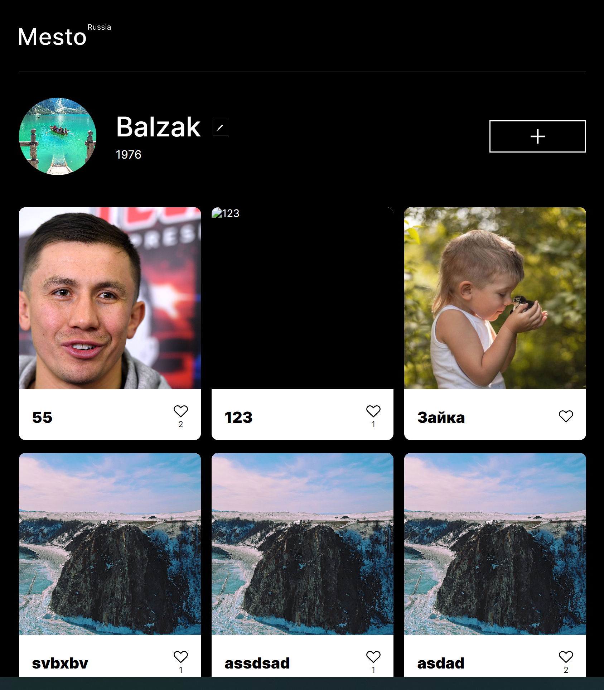

## Проект: MESTO

#### Ссылка на сайт: https://balzak1976.github.io/mesto/


## Описание и функциональность проекта

В проекте используются технологии: JavaScript, флекс-бокс, Grid Layout, методология БЭМ. Сайт адаптирован для устройств с шириной экрана от 320px, добавлена интерактивность.

<br>

А также:
- выполняется загрузка списка карточек, есть форма добавления карточек
- есть валидация форм, закрытие попапа, стилизация ошибок
- создан класс Card, FormValidator, разделены модули JavaScript
- созданы классы для отрисовки элементов, всплывающих окон, управления информацией о пользователе
- создан класс Api, методы для загрузки информации о пользователе и карточках, редактирования профиля, добавления новой карточки
- Улучшен UX всех форм


<div align="center">

### Главная страница

</div>




## Стэк технологий

| <a href="https://html.spec.whatwg.org/multipage/" target="_blank" rel="noreferrer"></a> | <a href="https://www.w3schools.com/css/" target="_blank" rel="noreferrer"></a> | <a href="https://www.javascript.com/" target="_blank"></a> | 
| :---: | :---: | :---: |
| HTML | CSS  | JS | 

<br>


## Запуск проекта

клонировать репозиторий 

```javascript
git clone https://github.com/Balzak1976/mesto.git
```

установить зависимости

```javascript
npm ci 
```
запуск проекта в режиме разработки 

```javascript
npm run dev 
```
создать финальную сборку ( папка `build` )

```javascript
npm run build 
```
<br>

[**Сайт свёрстан по макету Figma**](https://www.figma.com/file/2cn9N9jSkmxD84oJik7xL7/JavaScript.-Sprint-4?node-id=0%3A1)

[**Сайт выполнен на курсе Яндекс Практикум**](https://practicum.yandex.ru/profile/web/)
